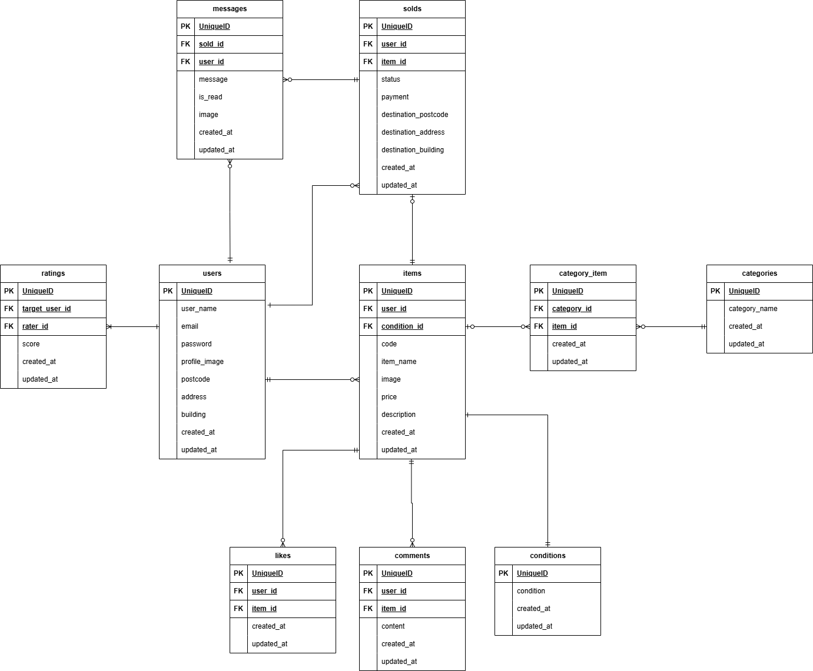

# Fleamarket （フリマアプリ）

## 環境構築

### Docker ビルド

1. git clone git@github.com:craftbyhako/fleamarket.git
2. DockerDesktopアプリを立ち上げる
3. docker-compose up -d --build

　※MacのM1・M2チップのPCの場合、no matching manifest for linux/arm64/v8 in the manifest list entriesのメッセージが表示されビルドができないことがあります。 エラーが発生する場合は、docker-compose.ymlファイルの「mysql」内に「platform」の項目を追加で記載してください　<br>

```
    mysql:
        platform: linux/x86_64(この文追加)
        image: mysql:8.0.26
        environment:
```


### Laravel 環境構築

1. docker-compose exec php bash <br>
2. composer install <br>
3. 「.env.example」ファイルを 「.env」ファイルに命名を変更。または、新しく.envファイルを作成　<br>
```
作成する場合：cp .env.example .env
```
4. .envに以下の環境変数を追加 <br>
```
        DB_CONNECTION=mysql
        DB_HOST=mysql
        DB_PORT=3306
        DB_DATABASE=laravel_db
        DB_USERNAME=laravel_user
        DB_PASSWORD=laravel_pass
```
5. アプリケーションキーの作成　<br>
    php artisan key:generate　<br>
6. ストレージのシンボリックリンクの作成　<br>
    php artisan storage:link <br>
7. マイグレーションの実行　<br>
    php artisan migrate　<br>
8. シーディングの実行　<br>
    php artisan db:seed　<br>

## 使用技術(実行環境)
PHP8.3.6　<br>
Laravel8.83.8　<br>
MySQL8.0.26　<br>

## URL
- 環境開発: http://localhost/ <br>
- phpMyAdmin: http://localhost:8080/ <br>

## メール機能（MailHog） 

アプリケーションから送信されるメール（購入者の取引完了の通知メール）は、開発環境では実際に送信されず、MailHog というツールによって確認できます。これにより、開発中に誤って本物のユーザーにメールが送信されることを防ぎます。

### 送信されたメールの確認方法

MailHog にアクセスすることで、アプリケーションが送信したメールの内容をブラウザ上で確認できます。

*   **MailHog Web UI:** [http://localhost:8025/](http://localhost:8025/)

購入者の「取引を完了する」ボタン押下後、上記のURLにアクセスし、Inbox（受信箱）を確認してください。

### 注意事項

*   **HTMLメールの表示について:** MailHog の WebUI では、HTML メールが最初に真っ白に見えることがあります。Inbox に戻り、再度メールを開き直すと正しく表示されます。本番環境のメールクライアントでは問題なく表示されるため、ご安心ください。


## ER 図



## テストアカウント
name: test1  
email: test@example.com1  
password: password  
※商品CO01～CO05を出品
-------------------------
name: test2  
email: test@example.com2  
password: password  
※商品CO06～CO10を出品
-------------------------
name: test3  
email: test@example.com3  
password: password  
※何も紐づいていないユーザー
-------------------------

## PHPUnitを利用したテストに関して
- テスト用データベースを作成しておく。
```
docker-compose exec mysql bash
mysql -u root -p (パスワードはrootと入力)
create database demo_test;
```

- .env.testing` にテスト用 DB の情報を設定しておく。
##### 例: `.env.testing`
```
DB_CONNECTION=mysql
DB_HOST=mysql
DB_PORT=3306
DB_DATABASE=demo_test
DB_USERNAME=laravel_user
DB_PASSWORD=laravel_pass
```

- コンテナ内の PHP に入り、テスト用マイグレーション・シーディング実行。
```
docker-compose exec php bash
php artisan migrate:fresh --seed --env=testing
```
- テストの実行。
```
php artisan test または ./vendor/bin/phpunit

特定テストのみ実行する場合:
php artisan test --filter=LoginTest
```  

## 特記事項

