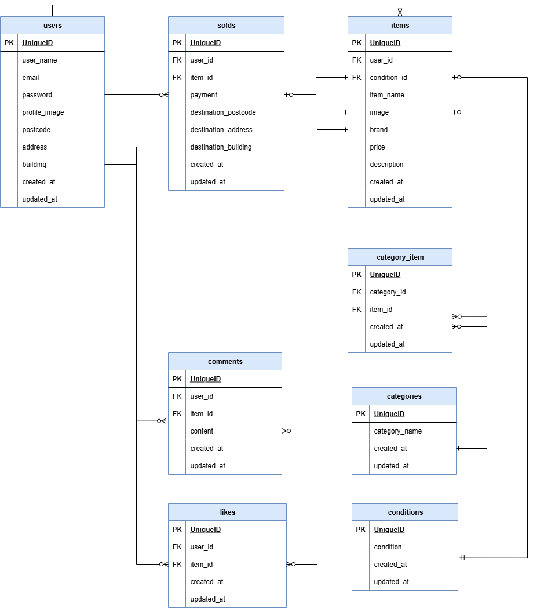

# Fleamarket （フリマアプリ）

## 環境構築

### Docker ビルド

1. git clone git@github.com:craftbyhako/fleamarket.git
2. DockerDesktopアプリを立ち上げる
3. docker-compose up -d --build

&nbsp;&nbsp;&nbsp;&nbsp;&nbsp;※MySQL は、OS によって起動しない場合があるのでそれぞれの PC に合わせて docker-compose.yml ファイルを編集してください。

### Laravel 環境構築

1. docker-compose exec php bash
2. composer install
3. cp .env.example .env
4. .env ファイルの一部を以下のように編集

```
DB_CONNECTION=mysql
DB_HOST=mysql
DB_DATABASE=laravel_db
DB_USERNAME=laravel_user
DB_PASSWORD=laravel_pass
```

5. php artisan key:generate
6. php artisan migrate
7. php artisan db:seed

## user のログイン用初期データ

- メールアドレス: hoge@example.com
- パスワード: 12345678

## 使用技術

- MySQL 15.1
- PHP 7.4.9
- Laravel 8.83.8

## URL

- 環境開発: http://localhost/
- phpMyAdmin: http://localhost:8080/

## ER 図

